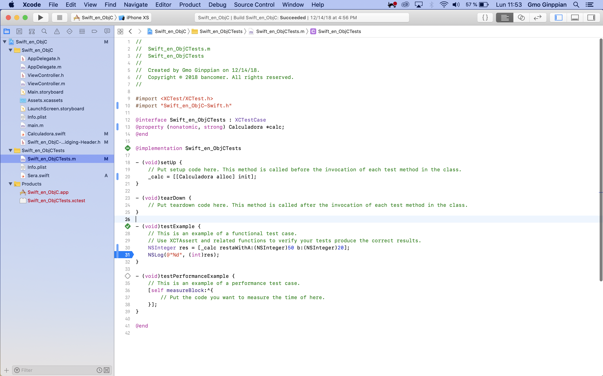

Agregar clases Swift en un proyecto de Objective-C
===

#### Herramientas:
* Xcode 10.1<br>
* Swift: 4.2


## Proceso:

<p align="justify">
	
</p>

<p align="justify">
	
</p>

<p align="justify">
	
</p>

<p align="justify">
	
</p>

<p align="justify">
	
</p>

<p align="justify">
	
</p>

<p align="justify">
	
</p>

<p align="justify">
	
</p>

<p align="justify">
	
</p>

<p align="justify">
	
</p>

<p align="justify">
	
</p>

<p align="justify">
	
</p>

## Test:

### Swift:

<p align="justify">
	
</p>

### Obj-C:

```
$CONFIGURATION_TEMP_DIR/YourProject.build/DerivedSources
```

<p align="justify">
	
</p>

<p align="justify">
	
</p>


## Fuente:

* <a href="https://stackoverflow.com/questions/41080100/swift-3-method-in-objective-c-fails-with-no-visible-interface-for-myswiftclass" >swift 3 method in objective-c fails with no visible @interface for 'MySwiftClass' declares the selector 'addX:andY'
</a>

* <a href="https://medium.com/if-let-swift-programming/ios-tests-working-with-objective-c-and-swift-class-together-aaf40f91a27c">iOS Tests working with Objective-C and Swift class together</a>

